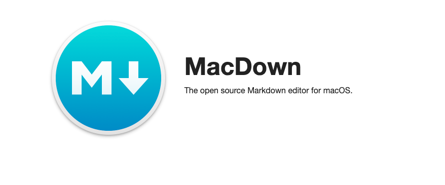

To add Headers
#Header

or we can make it small just have to add more
##SmallHeader

To bold text we just put them inside astrick 

**Bold**

To make text italicize use single astrick 

*italicize*

or use underscore key to italicize

_italicize_

#Ordered list 
1. Apples
2. Oranges
3. Bananas

#Unordered list

* Apples
* oranges 
* Bananas

or we can use -

- Grapes 

# Block Qoutes

To turn a text into a block qoute we just use > key 

> cake lollipop tiramisu tootsie roll

#Email Address
To make email address use < > keys 

<Jays@makeuseof.com>

#Inline URL links
This is an inline link, <http://apple.com>, in which the url is shown.

This is an inline link for [apple](http://apple.com.au), in which the URL is embedded.
 
#Adding inline Images 

